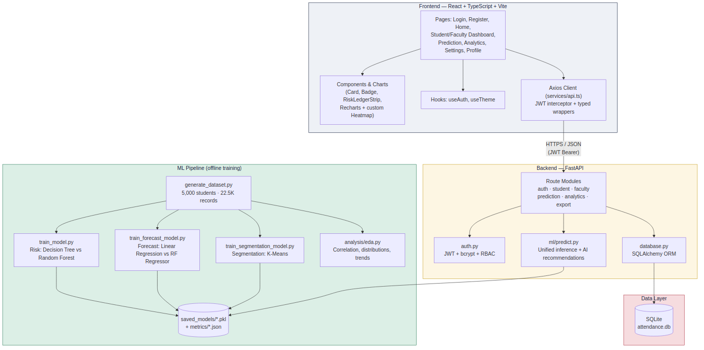
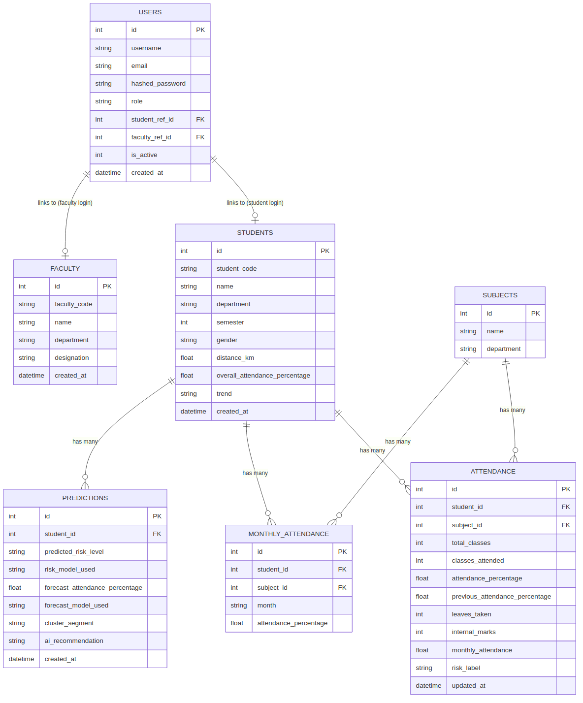
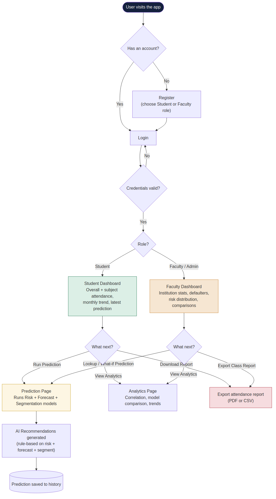

# Architecture, ER Diagram & Flowchart

## System Architecture

The application is split into three independently runnable layers: a React frontend, a FastAPI backend, and an offline ML training pipeline whose artifacts (`.pkl` model bundles + `.json` metrics) are loaded by the backend at request time.



**Key design decisions:**
- **Models are trained offline, served online.** `ml/train_*.py` scripts are run once (or whenever the dataset changes) and persist their winning model + metrics to disk. `ml/predict.py` loads each bundle exactly once per server process (a lazy-loaded singleton registry) rather than retraining or reloading on every request.
- **EDA/analytics are precomputed, not recomputed per-request.** `analysis/eda.py` writes `eda_summary.json` once; the `/api/analytics/overview` endpoint reads it rather than recomputing correlations over 20k+ rows on every page load.
- **The database is the single source of truth for live attendance data**; the original CSVs are only the seed data.

---

## Entity-Relationship Diagram



**Notes:**
- `USERS` is the authentication table; it optionally links to either a `STUDENTS` or `FACULTY` row via nullable foreign keys, so login identity is decoupled from profile data (a student's login username doesn't have to match their student code).
- `ATTENDANCE` is the primary per-subject record (one row per student × subject), carrying the ground-truth `risk_label` used to train Model 1.
- `MONTHLY_ATTENDANCE` is a long-format table (one row per student × subject × month) used for trend charts.
- `PREDICTIONS` stores every on-demand model run, so both the student's "latest prediction" and full history are queryable without re-running the models.

---

## User Flow



**Notes:**
- Registration and login converge on the same role-based redirect logic used throughout the frontend's route guards (`App.tsx`).
- Both dashboards funnel into the same Prediction and Analytics pages, which adapt their UI based on the logged-in role (see `PredictionPage.tsx`'s student vs. faculty mode).
- Every prediction run is persisted, feeding the "Prediction History" section shown on both the Student Dashboard and the Prediction page.

---

## Request Lifecycle Example: Running a Prediction

1. Frontend (`PredictionPage.tsx`) calls `predictionApi.predict({ student_code })` via the shared Axios client, which attaches the JWT bearer token.
2. `routes/prediction_routes.py` validates the token (`auth.py`), resolves access rules (`_resolve_target_student`), and pulls the student's live attendance features from the database (averaged across their enrolled subjects).
3. `ml/predict.py` loads (or reuses already-loaded) the risk classifier, forecast regressor, and K-Means segmentation bundles, runs all three, and generates rule-based AI recommendations from the combined output.
4. The result is persisted to the `PREDICTIONS` table and returned to the frontend as a `PredictionOut` JSON payload.
5. The frontend renders the risk badge, forecast %, segment badge, and recommendation list, and refreshes the prediction history list.

---

## Regenerating the Diagrams

The diagrams are authored in Mermaid (`docs/diagrams/*.mmd`) and rendered to PNG with `mermaid-cli`:
```bash
npm install -g @mermaid-js/mermaid-cli
cd docs/diagrams
mmdc -i architecture.mmd -o architecture.png -b white -w 1400 -H 900
mmdc -i er_diagram.mmd -o er_diagram.png -b white -w 1200 -H 900
mmdc -i flowchart.mmd -o flowchart.png -b white -w 1300 -H 1000
```
